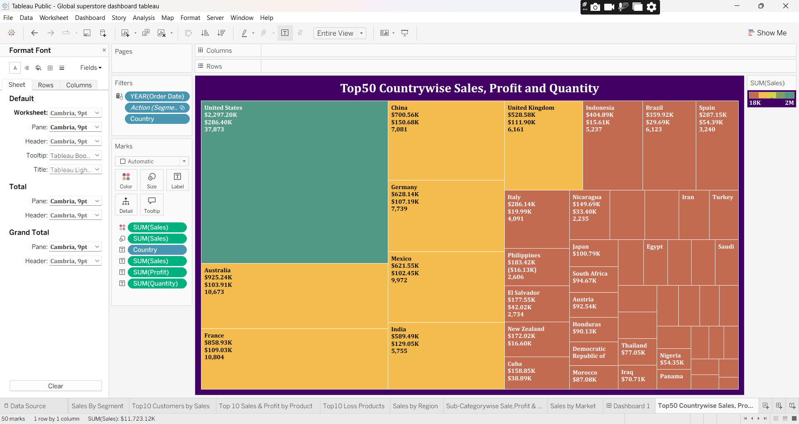

# 🌍 Global Superstore Sales Dashboard -- Tableau 

## 📊 Project Overview
This project is an interactive Global Superstore Sales Dashboard developed using Tableau Public.
The dashboard converts the Global Superstore dataset into an interactive business intelligence report covering:
Sales, Profit, Quantity, Returned orders, Average delivery days, Region-wise performance, Market-wise performance, Country-wise performance, Segment-wise sales, Sub-category performance, Product performance, Customer performance
The dashboard also uses Tableau actions so that users can interact with one chart and explore the related information across other visualizations.
<h2>📈 Dashboard Preview</h2>
<h3>Dashboard Image 1</h3> 
<h3>Dashboard Image 2</h3> 

<a href="Global%20superstore%20Sales%20dashboard%20tableau.twb">
📊 Download Tableau Workbook
</a>

## 🎯 Project Objectives
The main objectives of this dashboard are to:
Analyze overall business performance.
Identify regions and countries contributing strongly to sales.
Compare sales, profit, and quantity across sub-categories.
Understand the relationship between sales, profit, and quantity.
Identify top-selling products.
Identify products with high profit and products generating losses.
Identify the top customers by sales.
Compare customer segments.
Analyze sales across global markets.
Make the dashboard interactive using filters and Tableau actions.

## 🛠️ Tools & Technologies
Tableau Public
Excel (Global Superstore Dataset)
Data visualization and dashboard design
Filters, parameters, calculated fields and Tableau actions

## 📌 KPI cards
The dashboard currently displays the following overall KPIs:
KPI                             Value
* 💰 Sales                     $12.64M
* 📦 Quantity                   178.31K
* 🔄 Returned Orders              2,033
* 🚚 Average Delivery Days            4

They can change when filters/actions are applied.

## 📈 Dashboard Analysis
#### 1. 🌎 Sales by Region
The Sales by Region visualization uses a world map with bubbles representing sales performance across geographical regions.
The map allows users to compare regional sales visually.
Regional observations from the dashboard
Western Europe appears as one of the largest sales bubbles inthe current dashboard view.
Central America also shows a very large sales bubble.
Southeastern Asia and Southern Asia are other prominent sales regions.
Smaller bubbles are visible for regions such as Central Africa, Western Asia, and Central Asia.
The regional map is interactive, so the visible comparison can change when other dashboard filters/actions are applied.

#### 2. 🗺️ Country-wise Sales, Profit & Quantity
The Top 50 Countrywise Sales, Profit & Quantity treemap provides acountry-level analysis.
Each country is represented by a rectangle, with the visualization combining:Sales, Profit, Quantity
Key insight
The United States is the largest country-level sales contributor in the displayed dashboard view, with approximately $2.30M in sales, $286.40K profit, and 37,873 units.
This demonstrates that the country with the largest sales contribution can also have a substantial profit and quantity contribution.

#### 3. 🛍️ Sub-Category-wise Sales, Profit & Quantity
The Sub-Categorywise Sales, Profit & Quantity visualization compares
three important business measures:
Sales → bubble size 
Profit → vertical position
Quantity → Horizontal position
This visualization is particularly useful because it allows sales, profit, and quantity to be analyzed together.
Highest Sales: Phones — $1.71M
Highest Profit: Copiers — approximately $260K
Highest Quantity: Binders — approximately 21K

#### 4. 🔗 Relationship Between Sales, Profit & Quantity
High quantity does not necessarily mean high profit.
Highest sales does not necessarily mean highest profit.
The chart demonstrates the relationship between Sales, Profit, and Quantity across sub-categories.
Tables have very low sales compared with the leading sub-categories.

#### 5. 👥 Sales by Customer Segment
The Sales by Segment pie chart divides sales among three customer segments.
Segment:                
🛒 Consumer       
🏢 Corporate   
🏠 Home Office 
Key observation
The Consumer segment contributes the largest share of sales, accounting for 51.48% of the displayed total. Corporate contributes 30.25%, while Home Office contributes 18.27%.

#### 6. 👤 Top 10 Customers by Sales
The Top 10 Customers by Sales bar chart identifies the customers contributing the highest sales.
Purpose of this analysis: This visualization helps identify high-value customers and supports questions such as:
Who are the highest-sales customers?
Which customers contribute significantly to revenue?
How can customer-level performance be monitored?

#### 7. 🏆 Top 10 Sales & Profit by Product
A combined visualization highlights the top products based on sales and displays their corresponding profit/quantity information.
The orange bars represent sales, while the overlaid area provide Profit for comparison.
Key insight
The chart demonstrates that the highest-sales products do not necessarily have the same quantity ranking. Product performance should therefore be evaluated using sales, profit, and quantity together rather than using sales alone.

#### 8. 📉 Top 10 Loss Products
The Top 10 Loss Products chart identifies products with negative profit.
Examples visible in the dashboard include products such as:
Rogers-related products
Bevis Computer Table
Bevis Round Table
Cubify Cube 3D Printer
Motorola Smart Phone
Lexmark products
The chart helps identify products that may require further investigation because their sales are associated with negative profit.
Possible business questions
Are these products heavily discounted?
Are their costs too high?
Are returns affecting profitability?
Are certain regions or segments responsible for the losses?

#### 9. 🌍 Sales by Market
The Sales by Market treemap provides a high-level comparison of global markets.
The dashboard displays markets including:
Asia Pacific, Europe, LATAM, USCA, Africa, Canada
This visualization helps compare the contribution of different global markets and provides another geographical level of analysis beyond the region and country charts.

#### 10. 🔄 Tableau Actions

Interactivity is one of the main features of this dashboard.
Region Action: Selecting a region on the Sales by Region map allows the dashboard to respond to the selected geographical area.
Sub-Category Action: Selecting a sub-category allows the user to explore the related sales, profit, and quantity performance.
Segment Action: Selecting a customer segment such as Consumer, Corporate, or Home Office allows the other dashboard views to respond to the selected segment.
Year Filter: The dashboard also contains a Year filter, allowing users to analyze the dashboard for different years.
These interactions make the dashboard more useful for exploratory analysis instead of being a collection of static charts

### ❓ Business Questions Answered by the Dashboard
This dashboard can answer questions such as:
* What is the total sales value?
* How many units were sold?
* How many orders were returned?
* What is the average delivery time?
* Which region has the strongest sales?
* Which country contributes the most sales?
* Which market contributes the most sales?
* Which customer segment contributes the most sales?
* Which sub-category has the highest sales?
* Which sub-category has the highest profit
* How does quantity relate to sales and profit?
* Which products generate the highest sales?
* Which products generate losses?
* Who are the top customers by sales?
* How does performance change by year?
* How does selecting a region, segment, or sub-category affect the dashboard?
### 🚀 Skills Demonstrated
This project demonstrates practical skills in:
Tableau Public, Data visualization, Business intelligence, Dashboard development, Interactive dashboard design, Tableau actions, Filters, KPI creation, Geographic analysis, Customer analysis, Product analysis, Profitability analysis, Sales analysis, Data storytelling

